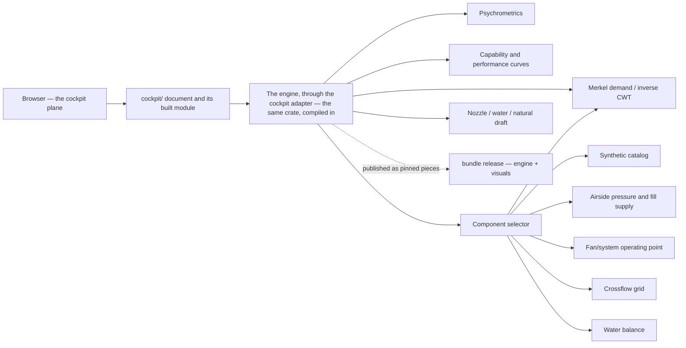
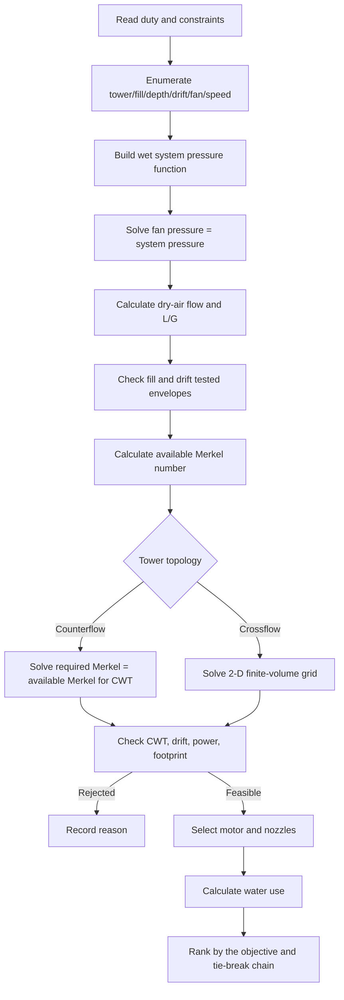
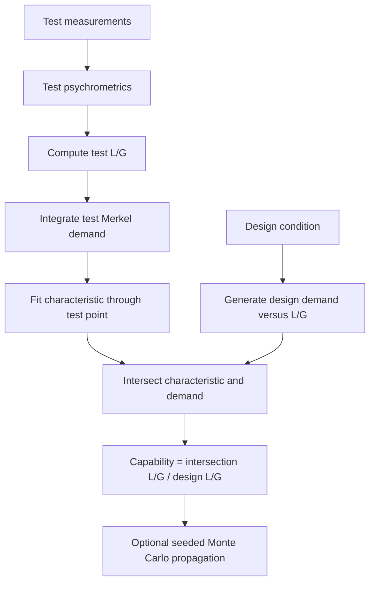
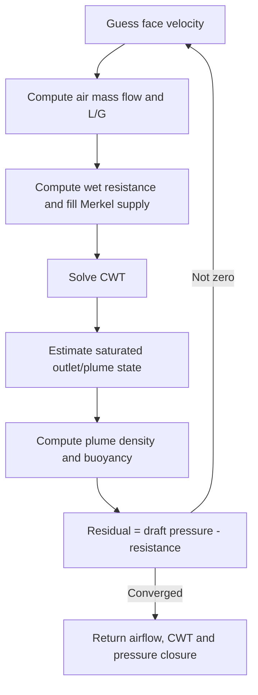

# Software and Solver Architecture

## 1. Design principles

- **SI internally:** unit conversion belongs at input/output boundaries.
- **Pure calculation modules:** core functions do not depend on the browser DOM.
- **Separated result classes:** acceptance-test capability, model rating and commercial selection are never represented by one generic percentage.
- **Data before optimization:** candidates are valid only inside controlled component domains.
- **Bounded numerical methods:** root solves scan and bracket physical intervals before bisection.
- **Traceability:** every output should retain solver, catalog and source revisions.

## 2. Runtime architecture



The public surface is the cockpit plane: `cockpit/` — a Bevy/WASM application whose document boots
its own built module (`cockpit/pkg/**`, built by `cockpit/tools/build-web.sh`), with the engine
compiled in through the cockpit adapter (issue #58). The plane's committed half is what
`deploy-manifest.txt` lists, and the release publishes it as its own artifact
(`scripts/cockpit-artifact.mjs`); the pinned `engine` and `visuals` pieces remain the repository's
distributable engine bundle (D16). The internal full application and the real catalog are out of
scope (the private release procedure, the private deployment procedure). The engine itself (`rust/`) has no runtime package
dependency: the native binary and the wasm build are the same crate, and the JavaScript reference the
port was checked against while it existed was retired in issue #40 slice 4 (last commit in it:
the private decision record D17); the retired JavaScript surface was the served surface until the cockpit became the product UI (issue #60, D22).

## 3. Mechanical-draft selection sequence

The selector's enumeration and solve sequence is unchanged by the port; the engine reads no commercial
field (issue #26's removal is kept), so candidates are ranked by the stated engineering objective and
its tie-break chain, not by lifecycle cost:



The present selector performs one fan/system solve using inlet density. A production implementation should add an outer convergence loop that updates outlet/plenum density and any density-dependent losses.

## 4. Characteristic-capability sequence



The licensed ATC-105 procedure may require additional corrections, validity checks and contractual conventions. Those are deliberately outside the current prototype.

## 5. Natural-draft sequence



## 6. Data boundaries

The sample catalog is executable JavaScript for convenience. The production boundary should instead be a validated data service with:

- immutable catalog revisions;
- per-record hashes;
- source-document links;
- units and normalization definitions;
- tested operating envelopes;
- interpolation/extrapolation policy;
- engineering approval status; and
- access/licence controls.

## 7. Suggested service decomposition

A production web system can retain the same core modules while adding:

```text
web-client/
calculation-api/
  properties/
  thermal/
  cti-evaluation/
  airside/
  selection/
component-data-service/
report-service/
validation-suite/
audit-store/
```

The calculation API should be stateless. A project service should store immutable input/result snapshots rather than allowing old results to be recomputed silently with new catalogs.
